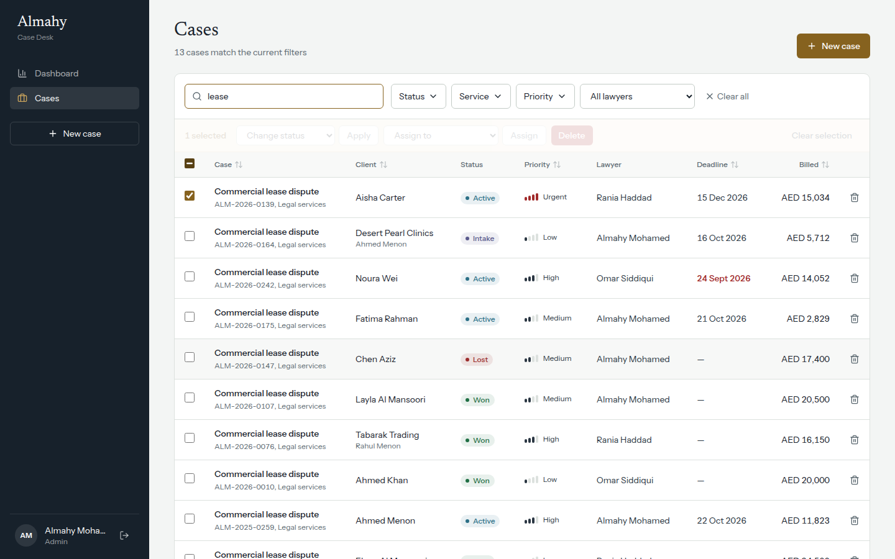
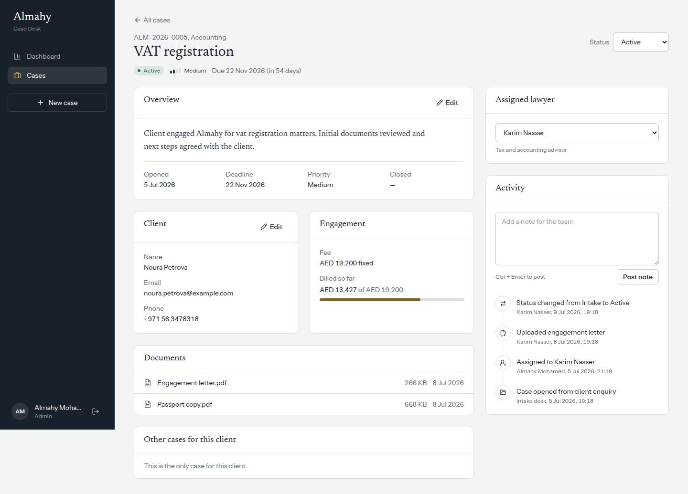
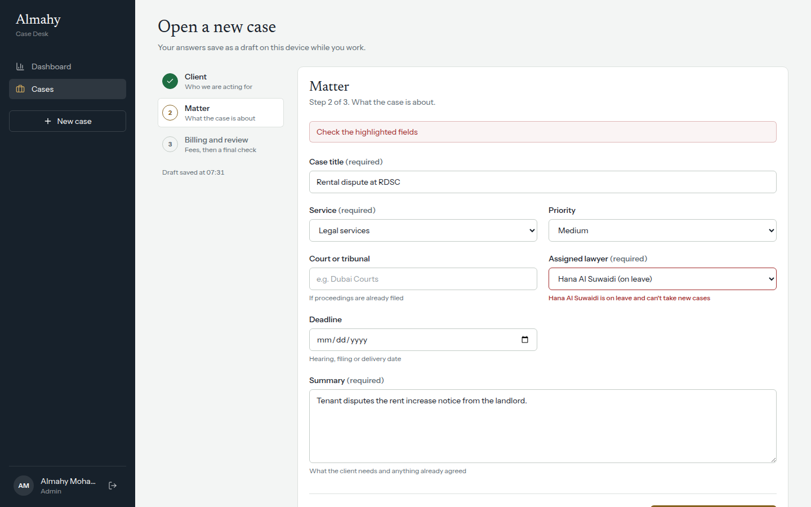

# Almahy Case Desk

An admin dashboard and case-management portal for **Almahy Legal Services** (Dubai), built for the Web Developer technical assessment.

Staff use it to track legal matters across the firm's six service lines (legal, corporate, notary, accounting, second passport, expert reports): practice analytics, a case register, a detailed case file with history, and a multi-step intake form.

- **Live demo:** `<add your Vercel URL>`
- **Stack:** Next.js 16 (App Router, Turbopack) · React 19 · TypeScript (strict) · Tailwind CSS v4 · TanStack Query v5 · React Hook Form + Zod v4 · Recharts · jose (JWT) · Vitest + Testing Library


---

## Quick start

Requires Node.js 20.9 or later.

```bash
npm install
cp .env.example .env.local   # then fill in the two required values
npm run dev                  # http://localhost:3000
```

| Script | What it does |
| --- | --- |
| `npm run dev` | Development server |
| `npm run build` / `npm start` | Production build and server |
| `npm test` | Unit and component tests (Vitest) |
| `npm run lint` | ESLint, including React Compiler rules |
| `npm run typecheck` | `tsc --noEmit` |

### Demo accounts

All three share the password set in `DEMO_PASSWORD`.

| Email | Role | Can |
| --- | --- | --- |
| `admin@almahy.demo` | Admin | Everything, including delete and reassign |
| `lawyer@almahy.demo` | Lawyer | Create and edit cases, bulk status changes. No delete, no reassign |
| `viewer@almahy.demo` | Read-only | View dashboard and cases |

Sign in as each role to see the UI adapt. The API enforces the same rules independently.

---

## Environment configuration

| Variable | Required | Description |
| --- | --- | --- |
| `SESSION_SECRET` | Yes | HS256 key for session JWTs, at least 32 characters. Generate with `openssl rand -base64 32`. The app refuses to issue sessions without it. |
| `DEMO_PASSWORD` | Yes | Shared password for the seeded demo accounts. |
| `SIMULATED_LATENCY_MS` | No (250) | Artificial API delay so skeletons and optimistic updates are visible. Set `0` to disable. |
| `SIMULATED_ERROR_RATE` | No (0) | Probability (0 to 1) that a write fails with 503. Set to `0.3` to watch rollbacks and error recovery. |

`.env.local` is git-ignored. Only `.env.example`, with placeholder values, is committed. None of these variables use the `NEXT_PUBLIC_` prefix, so none reach the browser bundle.

### Deploying to Vercel

1. Push the repository to GitHub and import it in Vercel. The framework is detected automatically.
2. Under **Settings → Environment Variables**, add `SESSION_SECRET` and `DEMO_PASSWORD` for Production.
3. Deploy. No build settings need changing.

---

## Features and where they live

| Requirement | Implementation |
| --- | --- |
| **Dashboard**: analytics, charts, KPIs, date range | `app/(app)/dashboard`: five KPIs with change vs the previous period, trend and service charts, status breakdown, workload, deadlines. Date presets and a custom range are stored in the URL. Chart granularity (day, week or month) adapts to the range. |
| **Management**: server pagination, search, sort, multi-filter, CRUD, bulk actions, confirmations, URL-synced filters | `components/cases/*`, `hooks/use-case-filters.ts`, `GET /api/cases`. Every filter, the sort, the page and the page size live in the query string. |
| **Detail**: dynamic route, editable sections, timeline, related records | `app/(app)/cases/[id]`: inline-editable overview and contact sections, quick status change, reassignment (admin only), notes, an activity timeline of every change, documents, and other cases for the same client. |
| **Advanced forms**: multi-step, client and server validation, conditional fields, autosave, states | `components/case-form/case-form.tsx`, `lib/cases/schema.ts`, `hooks/use-autosave.ts` |
| **API and state**: REST, async state, caching, optimistic updates, error recovery | `app/api/*`, `hooks/use-cases.ts`, `lib/api/client.ts` |
| **Security**: auth, RBAC, validation, env handling | `lib/auth/*`, `proxy.ts`, `lib/api/http.ts` |
| **Tests** | 41 tests in 8 files. See [Testing](#testing). |

<details>
<summary>More screenshots</summary>





</details>

---

## Architecture

```
src/
├── app/
│   ├── (app)/                  # Authenticated area; its layout calls requireSession()
│   │   ├── dashboard/          # Server Component: KPIs computed on the server
│   │   └── cases/              # list · [id] detail · new intake
│   ├── api/                    # REST route handlers (thin: parse → service → JSON)
│   └── login/
├── components/
│   ├── ui/                     # Design-system primitives: Button, Field, Dialog, Panel, Skeleton…
│   ├── cases/ case-detail/ case-form/ dashboard/ layout/
├── hooks/                      # TanStack Query hooks, URL filters, autosave, debounce
├── lib/
│   ├── auth/                   # jwt · permissions (RBAC) · dal (server checks) · users
│   ├── cases/                  # schema (Zod) · query-params · query (pure) · service
│   ├── analytics/              # pure KPI and series computation
│   ├── api/                    # browser fetch client · server route wrapper
│   └── db/                     # seeded in-memory store (the only file that knows about storage)
└── proxy.ts                    # Next 16 "proxy" (formerly middleware): optimistic auth redirect
```

**Layering.** Route handlers and Server Components never touch the data directly. Both call `lib/cases/service.ts`, which owns the business rules: activity logging, version checks, and "a lawyer on leave can't take new cases". The service uses `db` from `lib/db/store.ts`. Filtering, sorting, pagination and analytics are **pure functions**, so they are unit-tested without a server.

**One schema, three uses.** `lib/cases/schema.ts` validates the form in the browser, validates the request body in the API, and defines the TypeScript types. `lib/cases/query-params.ts` does the same for list filters: the URL, the React Query cache key and the server query are all derived from one Zod schema, so they can't drift apart. Multi-value filters are sorted into a canonical order, so the same filters always produce the same URL and cache key.

### Rendering strategy (Server vs Client Components)

| Route | Strategy | Why |
| --- | --- | --- |
| `/dashboard` | **Server Component** computes analytics. Only the date filter and charts are client code. Wrapped in `<Suspense key={range}>`. | Aggregation runs next to the data and arrives as HTML. The KPIs need no client JavaScript. Keying Suspense by range shows a skeleton instead of stale numbers. |
| `/cases` | Server shell (auth check, lawyer list), **Client Component** for the table | Filtering and paging re-fetch only JSON, never the whole page. The table stays interactive while new data loads. |
| `/cases/[id]` | **Server-rendered first paint**, then hydrated into TanStack Query via `initialData` | No loading spinner when opening a case, and edits are still optimistic and client-driven. |
| `/cases/new` | Server shell, **Client Component** form | The form is highly interactive and uses browser storage for drafts. |

Recharts, the heaviest dependency, is loaded with `next/dynamic` (`ssr: false`) only on the dashboard, so it is not in the initial JavaScript for any other route.

### State management

- **Server state: TanStack Query.** A query-key factory (`caseKeys`) defines cache identity, so invalidation is precise. Lists use `placeholderData: keepPreviousData`, so the old page stays on screen, dimmed, while the next one loads. The next page is prefetched. `staleTime` is 30s with refetch on window focus.
- **URL state:** filters, sort, pagination and dashboard date range. Views can be shared and bookmarked, survive a refresh, and work with the back button. Updates run inside `startTransition`.
- **Form state: React Hook Form.** Drafts autosave to `localStorage` (debounced, versioned key). Drafts deliberately stay on the device: a client's details shouldn't be stored on a server before the case exists.
- **Local UI state:** row selection and dialog visibility. The selection resets when the query changes.

No global store (Redux, Zustand) is needed. The URL and the query cache cover everything that's shared.

### API handling

REST endpoints under `/api`:

| Method | Path | Permission |
| --- | --- | --- |
| `GET` | `/api/cases?page&pageSize&q&status&service&priority&lawyer&sort&dir` | `case:read` |
| `POST` | `/api/cases` | `case:create` |
| `GET` / `PATCH` / `DELETE` | `/api/cases/:id` | read / update / delete |
| `POST` | `/api/cases/bulk` (`delete` · `status` · `assign`) | `case:bulk` (+ delete/assign for those actions) |
| `GET` | `/api/analytics?from&to` | `analytics:read` |
| `GET` | `/api/lawyers` | `case:read` |
| `POST` | `/api/auth/login` · `/api/auth/logout` | public |

- **Consistent errors.** Every handler goes through `withAuth()`, which returns `{ error, fieldErrors? }` with the correct status: 400, 401, 403, 404, 409, 422 or 500. Field errors use dotted paths (`matter.lawyerId`), so the form maps them straight onto inputs and jumps back to the step that owns the first error.
- **Optimistic updates with rollback.** Edits, deletes and bulk actions update every cached copy immediately. On failure the snapshot is restored and a toast explains what went wrong. On settle, the lists are re-synced with the server.
- **Optimistic concurrency.** Every case has a `version`. A `PATCH` with a stale version gets **409**, so two people editing the same case can't silently overwrite each other. The toast offers a reload.
- **Retries.** Network errors and 5xx responses retry with exponential backoff. 4xx responses (validation, permissions) don't, because retrying won't change the answer. A 401 anywhere sends the user to `/login?next=…`.
- **Cancellation.** Queries pass the `AbortSignal`, so fast typing in the search box cancels superseded requests. The search is also debounced (300ms).

### Security

- **Authentication.** Signed HS256 JWT (`jose`) in an `httpOnly`, `SameSite=Lax` cookie, marked `Secure` in production, with an 8-hour expiry. The password check uses `timingSafeEqual`, and the error message is the same whether the email or the password is wrong.
- **Defence in depth.** `proxy.ts` makes an optimistic redirect for signed-out users. The **real** checks run in the Data Access Layer (`requireSession` / `requirePermission`) for pages, and in `withAuth(permission)` for every API route. The UI hides actions with `can()`, but hiding a button is UX, not security.
- **Role-based access.** A single permission matrix in `lib/auth/permissions.ts` drives both UI and API. Field-level rules apply too: a lawyer's `PATCH` that includes `lawyerId` is rejected with 403.
- **Input validation.** Zod on every body and query string. The update schema is `.strict()`, so unknown fields like `billed` are rejected (no mass assignment). Bulk operations are capped at 100 ids. Query params are clamped to safe values.
- **Other protections:** open-redirect protection on `?next=`. Security headers (`X-Frame-Options: DENY`, `nosniff`, `Referrer-Policy`, `Permissions-Policy`). `poweredByHeader` is disabled, and `robots: noindex` is set.
- **Secrets** exist only in environment variables. `.env*` is git-ignored except the placeholder example.

### Performance

- Server Components for the dashboard, case detail first paint and all page shells. Only interactive islands ship JavaScript.
- Lazy-loaded chart bundle, and `next/image` (AVIF/WebP, `sizes`, `priority`) for the login artwork.
- Self-hosted variable fonts through `next/font/local`: no request to Google Fonts and no layout shift.
- The list API returns a lightweight row shape, without activity, documents or summary.
- Table rows are `memo`ised with stable callbacks, so ticking one checkbox re-renders one row. The code also passes the React Compiler lint rules (no `setState` in effects, no impure calls during render).
- Prefetching the next page, cached revalidation, request cancellation and debounced search keep network traffic low.

### Accessibility and UX

- Keyboard-accessible throughout, with a skip link and visible focus rings.
- The native `<dialog>` handles focus trapping, Escape to close and an inert background. Destructive dialogs focus **Cancel** first.
- Sortable headers expose `aria-sort`. Filter menus return focus to their trigger on Escape. Form fields are wired to their hints and errors with `aria-describedby` and `aria-invalid`. Moving between steps moves focus to the step heading.
- Skeleton loaders announce "Loading" to screen readers. Empty states say what to do next, and error states offer a retry.
- Animations only respond to user actions (dialogs, menus, conditional fields) and respect `prefers-reduced-motion`.
- Fully responsive: sidebar on desktop, drawer on mobile, and table columns that drop by priority on narrow screens.

---

## Testing

```bash
npm test
```

| File | Covers |
| --- | --- |
| `lib/cases/__tests__/query.test.ts` | Filtering, sorting, pagination bounds, search, URL round-trip, canonical ordering |
| `lib/cases/__tests__/schema.test.ts` | Conditional validation (company, corporate, hourly), past deadlines, coercion, strict updates, bulk limits |
| `lib/auth/__tests__/jwt.test.ts` | Session round-trip, tampered-token rejection |
| `lib/auth/__tests__/permissions.test.ts` | The role matrix |
| `lib/analytics/__tests__/compute.test.ts` | KPI maths, previous-period change, bucket filling, range parsing |
| `components/__tests__/*.test.tsx` | ConfirmDialog, Pagination and FilterMenu behaviour and accessibility |

The priority is the logic that would cause real damage if wrong: permissions, validation, data queries and money.

---

## Trade-offs and known limits

- **In-memory data store.** Seeded, deterministic data (260 cases), so the project runs with zero infrastructure. On serverless hosting each instance keeps its own copy, which resets on cold start. All storage access sits behind `lib/db/store.ts`, so replacing it with Postgres through Prisma or Drizzle is a change to one file.
- **Demo authentication.** Seeded users with a shared password. A production system would use per-user hashed passwords (argon2) or SSO (Microsoft Entra ID is typical for UAE firms), plus refresh-token rotation and login rate limiting.
- **Documents** are shown as records. Real uploads would go to object storage using signed URLs.
- **A viewer who opens `/cases/new`** is redirected client-side. The page streams first because of its loading boundary. The server still renders nothing sensitive, and the API rejects any write.

## Scaling to a larger production environment

1. **Data:** Postgres with indexes on `(status, service, opened_at)`, a full-text search index on reference, title and client, and **cursor-based pagination** for deep pages. Pre-aggregate analytics into a daily materialized view, or a read replica, instead of scanning cases per request.
2. **Caching:** `'use cache'` / `cacheTag` for analytics, with `revalidateTag` after writes. Add Redis for shared caching and rate limiting across instances.
3. **Auth:** SSO, short-lived access tokens with rotating refresh tokens, audit logging of every permission-sensitive action, and per-matter access control (ethical walls between client teams).
4. **API:** an OpenAPI contract and generated typed client, idempotency keys on `POST`, and background jobs for bulk operations over large selections.
5. **Frontend:** virtualised table rows for very large pages, and bilingual Arabic and English with RTL layout using logical CSS properties. Tailwind's `ms-`/`me-` utilities make this straightforward.
6. **Operations:** error tracking (Sentry), Web Vitals monitoring, end-to-end tests (Playwright) in CI on every pull request, and preview deployments.

---

## Use of AI

AI assistance was used for scaffolding, boilerplate and debugging. It was used with the reviewers' permission, as stated in the brief. The architecture and trade-offs were reviewed, understood and adjusted by me, and every file can be explained in the technical review.
