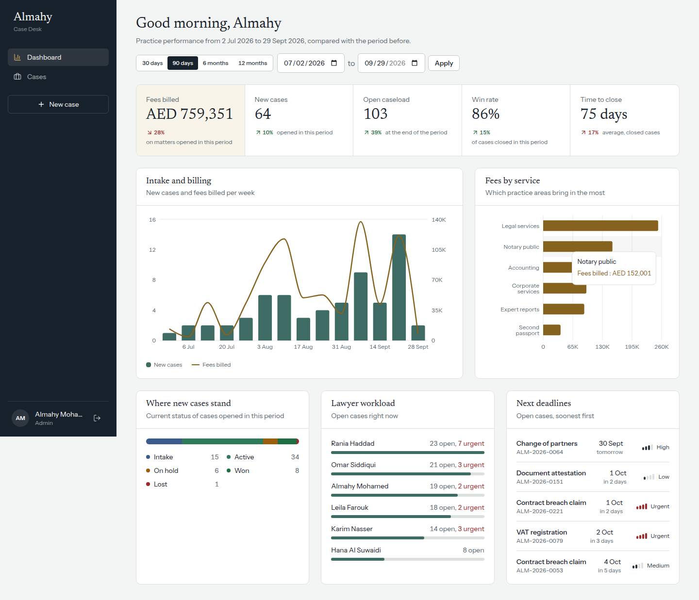

# Almahy Case Desk

An admin dashboard and case-management portal for **Almahy Legal Services** (Dubai), built for the Web Developer technical assessment.

Staff use it to track legal matters across the firm's six service lines (legal, corporate, notary, accounting, second passport, expert reports): practice analytics, a case register, a detailed case file with history, and a multi-step intake form.

- **Live demo:** https://almahy-admin.vercel.app
- **Repository:** https://github.com/youssif14/almahy-admin
- **Stack:** Next.js 16 (App Router, Turbopack) · React 19 · TypeScript (strict) · Tailwind CSS v4 · TanStack Query v5 · React Hook Form + Zod v4 · Recharts · jose (JWT) · Vitest + Testing Library



---

## Quick start

Requires Node.js 20.9 or later.

```bash
npm install
cp .env.example .env.local   # Windows: copy .env.example .env.local — then fill in the two required values
npm run dev                  # http://localhost:3000
```

| Script | What it does |
| --- | --- |
| `npm run dev` | Development server |
| `npm run build` / `npm start` | Production build and server |
| `npm test` | Unit and component tests (Vitest) |
| `npm run lint` | ESLint, including React Compiler rules |
| `npm run typecheck` | `tsc --noEmit` |

### Demo accounts

All three share the password set in `DEMO_PASSWORD`.

| Email | Role | Can |
| --- | --- | --- |
| `admin@almahy.demo` | Admin | Everything, including delete and reassign |
| `lawyer@almahy.demo` | Lawyer | Create and edit cases, bulk